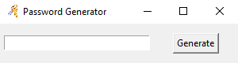
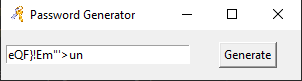

# Random Password Generator - Python

## Description:
Randomly generating a password that includes special characters, digits, upper case & lower case letters.

## How to use
1. Install Python 3.8.X from [here](https://www.python.org/downloads/)
2. Install [pipenv](https://pypi.org/project/pipenv/)
3. Clone this repository: `git clone https://github.com/iam-hasibul/random-password-generator` or click `Download ZIP` in the right panel and extract it.
4. Run `python main.py` from the repository's directory

## Screenshots

